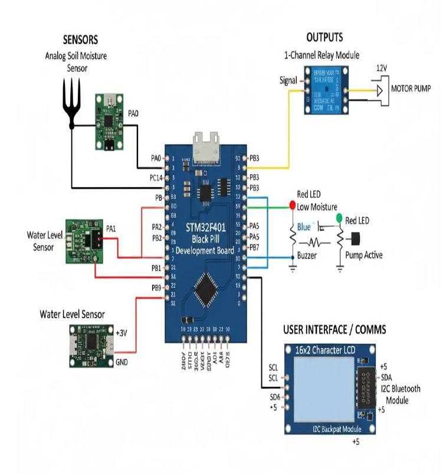

# STM32F4 Soil & Water Monitoring System

This project implements an automated irrigation and monitoring system using the STM32F4xx microcontroller. It monitors soil moisture and water levels using ADC sensors, displays real-time data on an I2C LCD, and controls actuators (pumps/valves) based on threshold logic.

## Features
* **Soil Moisture Monitoring:** Analog reading mapped to percentage.
* **Water Level Detection:** Prevents pump operation if water is low.
* **Display Interface:** 16x2 LCD via I2C (PCF8574) and UART debugging output.
* **Automated Control:** Toggles GPIO pins based on moisture thresholds.
* **Error Handling:** Auto-detects LCD connection issues and falls back to UART.

## Hardware Requirements
* STM32F4 Microcontroller (e.g., STM32F401/F411/F407 Discovery)
* Soil Moisture Sensor (Analog)
* Water Level Sensor (Analog)
* 16x2 LCD Display with I2C Backpack (PCF8574)
* Relays/LEDs for output indication

## Circuit Diagram

## Pin Configuration (Based on Code)

| Component | STM32 Pin | Function |
| :--- | :--- | :--- |
| **Soil Sensor** | PA0 | ADC1 Channel 0 |
| **Water Sensor** | PA1 | ADC1 Channel 1 |
| **I2C LCD (SCL)** | PB6 | I2C1 SCL |
| **I2C LCD (SDA)** | PB7 | I2C1 SDA |
| **UART TX** | PA2 | Debug Output |
| **UART RX** | PA3 | Debug Input |
| **Pump/Relay 1** | PC14 | Active when Moisture < 40% |
| **Pump/Relay 2** | PA5 | Active when Water < Threshold |
| **Status LED** | PC13 | System Logic Indicator |

## Logic Thresholds
* **Moisture < 40%:** Turn ON Irrigation (PC14 High).
* **Moisture > 50%:** Turn OFF Irrigation (PC14 Low).
* **Water Level < 1000 (ADC):** Low water warning (PA5 High).

## How to Build
1. Open the project in Keil uVision / STM32CubeIDE.
2. Ensure `stm32f4xx.h` CMSIS drivers are included in your path.
3. Compile and Flash to the target board.